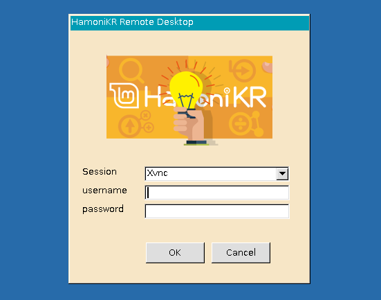

## Remote Desktop Access for HamoniKR

 * 이 패키지가 지원되는 버전은 하모니카 6.0 이후 
 * xrdp 0.10.0 버전에서 하모니카 OS 환경에 맞게 패치한 버전입니다.

 * 원격 데스크톱 접속 시 한영키 사용 가능
 * 원격 접속 시 권한 재 조정
 * 백엔드를 vnc 기본으로 설정
 * 원격접속 시 디스크 공유 및 사운드 공유 지원
 * 클립보드 (복사하기 Ctrl+c, 붙여넣기 Ctrl+v) 지원

### Patch

* The version that supports this package is after HamoniKR 6.0
* This version is patched for HamoniKR OS environment in the XRDP 0.10.0 version.
* Korean Young Key can be used when accessing remote desktops
* Re -adjustment of authority when accessing remote
* Set the backend by VNC standard
* Disk sharing and sound sharing support for remote access
* Clipboard (Copy Ctrl+C, Paste Ctrl+V) Support 